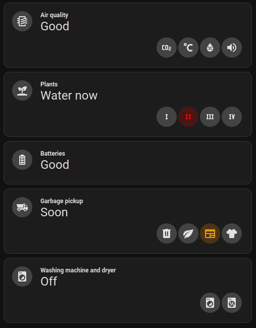
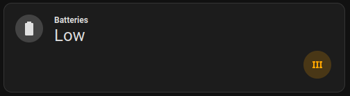
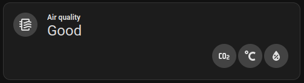
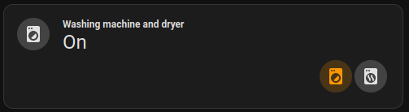
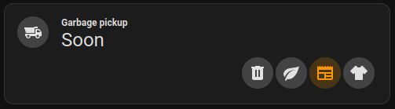

# Entity Group Status


Custom Home Assistant card grouping multiple entities and displaying a status text based on the state of those entities.



## Installation

@todo

## Configuration

### Main Options

| Name              | Type        | Default      | Supported options               | Description                               |
|-------------------|-------------|--------------|---------------------------------|-------------------------------------------|
| `type`            | string      | **Required** | `custom:entity-group-status`    | Type of the card                          |
| `title`           | string      | optional     | Any string                      | Main title of the card                    |
| `icon`            | string      | optional     | `mdi:battery`                   | Main icon of the card                     |
| `iconScoreColor`  | boolean     | false        | `false` \| `true`               | Use status color for main icon            |
| `scores`          | object list | **Required** | See [Scores](#scores)           | Scores determining card and entity status |
| `entities`        | object list | {}           | See [Entities](#entities)       | Entities shown on the card                |
| `dateFormat`      | object list | optional     | See [Date format](#date-format) | Date format                               |
| `actions`         | object      | optional     | See [Actions](#actions)         | Actions for the card                      |

### Scores

| Name         | Type   | Default      | Supported options                                                             | Description                          |
|--------------|--------|--------------|-------------------------------------------------------------------------------|--------------------------------------|
| `score`      | number | **Required** | Any integer number                                                            | Score                                |
| `color`      | string | `inherit`    | Any color, eg: `red`, `#fcaa00`, `rgb(28, 128, 199)` or `var(--accent-color)` | Color                                |
| `text`       | string | optional     | Any string                                                                    | Status text                          |
| `hideEntity` | bool   | `false`      | `false` \| `true`                                                             | Do not show entities with this score |

### Entities

| Name           | Type        | Default      | Supported options                   | Description                                          |
|----------------|-------------|--------------|-------------------------------------|------------------------------------------------------|
| `entity`       | string      | **Required** | `sensor.my_sensor_id`               | Entity ID                                            |
| `title`        | string      | optional     | Any string                          | Title of the entity                                  |
| `icon`         | string      | optional     | `mdi:battery`                       | Icon of the entity                                   |
| `states`       | object list | optional     | See [Entity states](#entity-states) | States of the entity                                 |
| `actions`      | object      | optional     | See [Actions](#actions)             | Actions for the entity                               |
| `stateConvert` | string      | optional     | `date`                              | Convert entity state. Currently only supports `date` |

### Entity States

| Name     | Type             | Default      | Supported options                                  | Description                    |
|----------|------------------|--------------|----------------------------------------------------|--------------------------------|
| `score`  | number           | **Required** | Any number defined as score. See [Scores](#scores) | The score of this state        |
| `max`    | number \| string | optional     | Any number or date string                          | The maximum for this state     |
| `min`    | number \| string | optional     | Any number or date string                          | The minimal for this state     |
| `equals` | number \| string | optional     | Any number or date string                          | The exact value for this state |

### Date format

| Name      | Type   | Default                | Supported options                                             | Description                             |
|-----------|--------|------------------------|---------------------------------------------------------------|-----------------------------------------|
| `locale`  | string | Browser default locale | Any locale string, eg: `en-US` or `nl`                        | The locale to use for displaying a date |
| `options` | object | optional               | Any option used in the JavaScript `toLocaleDateString` method | Options for the date format             |

### Actions

See [Actions documentation](https://www.home-assistant.io/dashboards/actions/). Currently only the tab action is supported.

## Examples

### Battery charge



```yaml
type: custom:entity-group-status
title: Batteries
icon: mdi:battery
scores:
  - score: 1
    text: Good
    hideEntity: true
  - score: 2
    color: orange
    text: Low
  - score: 3
    color: red
    text: Very low
entities:
  - entity: sensor.battery_sensor_1
    title: Battery sensor 1
    icon: mdi:roman-numeral-1
    actions:
      tap_action:
        action: more-info
    states:
      - max: 15
        score: 3
      - max: 20
        score: 2
      - score: 1
  - entity: sensor.battery_sensor_2
    title: Battery sensor 2
    icon: mdi:roman-numeral-2
    actions:
      tap_action:
        action: more-info
    states:
      - max: 15
        score: 3
      - max: 20
        score: 2
      - score: 1
  - entity: sensor.battery_sensor_2
    title: Battery sensor 2
    icon: mdi:roman-numeral-2
    actions:
      tap_action:
        action: more-info
    states:
      - max: 15
        score: 3
      - max: 20
        score: 2
      - score: 1
```

### Air quality



```yaml
type: custom:entity-group-status
title: Air quality
icon: mdi:air-filter
actions:
  tap_action:
    action: navigate
    navigation_path: /lovelace/airquality
scores:
  - score: 1
    text: Good
  - score: 2
    color: orange
    text: Fine
  - score: 3
    color: red
    text: Bad
entities:
  - entity: sensor.carbon_dioxide_sensor
    title: CO2
    icon: mdi:molecule-co2
    actions:
      tap_action:
        action: more-info
    states:
      - max: 900
        score: 1
      - max: 1500
        score: 2
      - score: 3
  - entity: sensor.temperature_sensor
    title: Temperature
    icon: mdi:temperature-celsius
    actions:
      tap_action:
        action: more-info
    states:
      - max: 16
        score: 3
      - max: 19.5
        score: 2
      - max: 23
        score: 1
      - max: 30
        score: 2
      - score: 3
  - entity: sensor.humidity_sensor
    title: Humidity
    icon: mdi:water-percent
    actions:
      tap_action:
        action: more-info
    states:
      - max: 25
        score: 3
      - max: 40
        score: 2
      - max: 60
        score: 1
      - max: 75
        score: 2
      - score: 3
```

### Washing machine and dryer status



```yaml
type: custom:entity-group-status
title: Washing machine and dryer
icon: mdi:washing-machine
scores:
  - score: 1
    text: Off
  - score: 2
    color: var(--accent-color)
    text: On
entities:
  - entity: input_select.washingmachine_status
    title: Washing machine
    icon: mdi:washing-machine
    actions:
      tap_action:
        action: more-info
    states:
      - equals: 'On'
        score: 2
      - score: 1
  - entity: input_select.dryer_status
    title: Dryer
    icon: mdi:tumble-dryer
    actions:
      tap_action:
        action: more-info
    states:
      - equals: 'On'
        score: 2
      - score: 1
```

### Garbage pickup dates



```yaml
type: custom:entity-group-status
title: Garbage pickup
icon: mdi:dump-truck
dateFormat:
  locale: en-US
  options:
    weekday: long
    day: numeric
    month: long
    year: numeric
scores:
  - score: 1
    text: Not yet
  - score: 2
    color: var(--accent-color)
    text: Soon
  - score: 3
    color: orange
    text: Tomorrow
  - score: 4
    color: red
    text: Today
entities:
  - entity: sensor.mijnafvalwijzer_restafval
    title: Residual waste
    icon: mdi:trash-can
    stateConvert: date
    actions:
      tap_action:
        action: more-info
    states:
      - max: today
        score: 4
      - max: tomorrow
        score: 3
      - max: 4 days from now
        score: 2
      - score: 1
  - entity: sensor.mijnafvalwijzer_gft
    title: Compostable
    icon: mdi:leaf
    stateConvert: date
    actions:
      tap_action:
        action: more-info
    states:
      - max: today
        score: 4
      - max: tomorrow
        score: 3
      - max: 4 days from now
        score: 2
      - score: 1
  - entity: sensor.mijnafvalwijzer_papier
    title: Paper
    icon: mdi:newspaper
    stateConvert: date
    actions:
      tap_action:
        action: more-info
    states:
      - max: today
        score: 4
      - max: tomorrow
        score: 3
      - max: 4 days from now
        score: 2
      - score: 1
  - entity: sensor.mijnafvalwijzer_textiel
    title: Textile
    icon: mdi:tshirt-crew
    stateConvert: date
    actions:
      tap_action:
        action: more-info
    states:
      - max: today
        score: 4
      - max: tomorrow
        score: 3
      - max: 4 days from now
        score: 2
      - score: 1
```